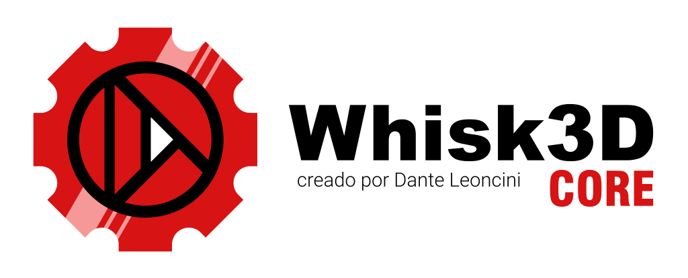

# Whisk3D Core

    

## Motor multiplataforma 2D y 3D estilo retro

Whisk3D Core es un motor 3D multiplataforma. Es una biblioteca escrita en C++ para crear juegos y aplicaciones 2D/3D livianas que funcionan tanto en sistemas modernos como retro. Proporciona una API gráfica unificada que abstrae las diferencias entre las distintas APIs de renderizado y sistemas operativos, permitiendo desarrollar una vez y ejecutar en Windows, Linux, Android, Symbian y navegadores web (pueden sumarse mas sistemas en el futuro).

Su diseño prioriza la simplicidad, el rendimiento y la portabilidad, inspirándose en motores clásicos como RenderWare y siendo ideal para proyectos con estética retro o de bajos requisitos.

**NOTA:** El proyecto aun no esta listo para usar en produccion. se siguen haciendo cambios y reescrituras!. cualquier duda, pueden consultar en el grupo de [Telegram](https://t.me/Whisk3D)
Actualmente sigo limpiando el Core para:
* Simplificar el codigo... tiene mucha logica aun del Whisk3D Editor (modo edicion, modo objeto, modes de render, Mesh Editor, Modificadores. todo eso NO va en el Core)
* Comprobar que funciona bien con otras apis graficas como Vulkan, WebGl, DirectX
* Soportar otros sistemas y backend graficos retros.
* Agregar ejemplos y documentacion

Whisk3D Core incluye los componentes fundamentales de un motor 3D, entre ellos:

* Abstracción del pipeline de renderizado.
* Representación de mallas y geometría.
* Materiales y texturas.
* Cámaras y administración de vistas.
* Sistema de iluminación.
* Objetos de escena y transformaciones.
* Buffers de vértices e índices.
* Estados básicos de renderizado.
* Utilidades matemáticas (vectores, matrices y cuaterniones).

El proyecto está diseñado para facilitar la implementación de nuevos backends gráficos (como OpenGL, OpenGL ES, WebGl, Vulkan, Direct3D, Metal o renderizadores por software) sin necesidad de modificar el código de alto nivel del motor.

## Sus principales objetivos son:

* Compatibilidad multiplataforma.
* Independencia de la API gráfica.
* Arquitectura limpia y modular.
* Ligero y fácil de portar.
* Compatible con computadoras de escritorio, dispositivos móviles, sistemas embebidos y plataformas retro.

Whisk3D Core constituye la base del motor y del editor Whisk3D, pero también puede utilizarse como un framework de renderizado independiente para otros proyectos.

El código esta bajo licencia MIT. asi que podes usuarlo en tus propios proyectos ya sean libres o comerciales. podes hacer un fork. modificarlo etc.
